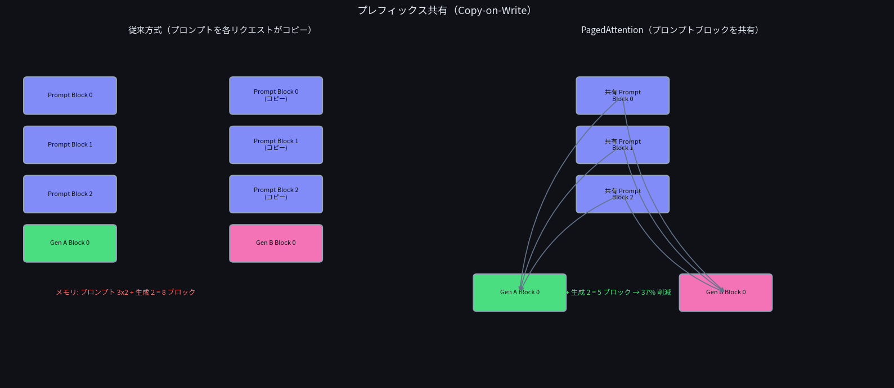
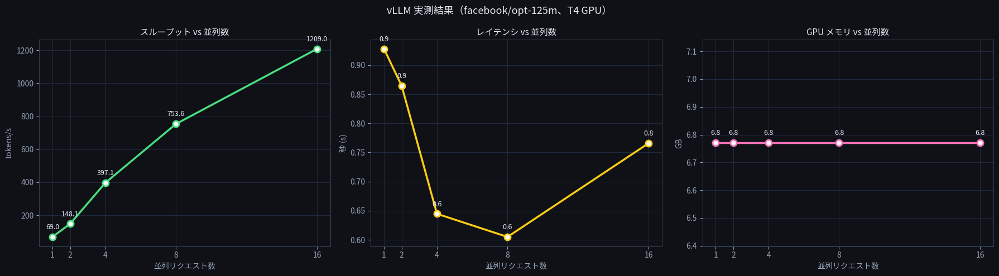

# 🧠 PagedAttention Demo on Google Colab

vLLM の **PagedAttention** を概念図と実測データで理解するための Jupyter Notebook です。  
Google Colab の T4 GPU 上で動作確認済みです。

[](https://colab.research.google.com/github/YOUR_USERNAME/YOUR_REPO/blob/main/paged_attention_full_demo_jp.ipynb)

---

## 📋 目次

- [概要](#概要)
- [実行環境](#実行環境)
- [ノートブックの構成](#ノートブックの構成)
- [Part 1：概念の可視化](#part-1概念の可視化)
- [Part 2：vLLM 実測結果と解説](#part-2vllm-実測結果と解説)
- [使い方](#使い方)

---

## 概要

LLM の推論において、**KV キャッシュ**（過去のトークンの Key・Value を保存するメモリ）の管理方法がスループットを大きく左右します。

vLLM が 2023 年に発表した **PagedAttention** は、OS のメモリページング機構からインスピレーションを得て、KV キャッシュを固定長の「ブロック」に分割して管理します。これにより：

- GPU メモリの断片化・無駄をほぼゼロにする
- 複数リクエスト間でプロンプトのブロックを共有できる（Copy-on-Write）
- 並列リクエスト数が増えるほどスループットが向上する

このリポジトリでは、上記の仕組みを **matplotlib の概念図** と **vLLM の実測データ** の両面から理解できます。

---

## 実行環境

| 項目 | 内容 |
|---|---|
| GPU | NVIDIA T4（Google Colab 無料プラン） |
| VRAM | 14.56 GB |
| vLLM | 0.6.6 |
| モデル | facebook/opt-125m |
| numpy | 1.26.4 |
| transformers | 4.46.3 |
| protobuf | 4.25.3 |

> **vLLM 0.7 以降は T4（sm_75）非対応のため 0.6.6 を使用しています。**

---

## ノートブックの構成

```
paged_attention_full_demo_jp.ipynb
│
├── ⚙️  インストール（日本語フォント含む）
├── ⚙️  日本語フォントの設定
│
├── Part 1：概念の可視化（GPU 不要）
│   ├── 1-1. 従来方式 vs PagedAttention のメモリ管理
│   ├── 1-2. トークン生成によるブロック割り当てアニメーション
│   └── 1-3. プレフィックス共有（Copy-on-Write）の図解
│
└── Part 2：vLLM 実測デモ（GPU 必要）
    ├── 2-1. モデルのロード
    ├── 2-2. 並列リクエスト数を変えてスループットを実測
    └── 2-3. 実測結果の可視化
```

---

## Part 1：概念の可視化

### 1-1. 従来方式 vs PagedAttention のメモリ管理

従来の推論エンジンは、リクエストごとに **最大シーケンス長分のメモリを連続して事前確保** します。実際にはその一部しか使わないため、大量のメモリが無駄になります。

PagedAttention は使用した分だけブロックを割り当てるため、メモリの無駄がほぼゼロになります。

| | 従来方式 | PagedAttention |
|---|---|---|
| 使用スロット | 11 | 11 |
| 予約スロット | 24 | 11 |
| 無駄なスロット | 13 | 0 |
| **メモリ効率** | **46%** | **100%** |

### 1-2. トークン生成アニメーション

トークンが1つずつ生成されるにつれてブロックが埋まっていく様子を可視化しています。従来方式との効率比較バーを並べて表示することで、PagedAttention がいかに無駄なくメモリを使うかが直感的にわかります。

### 1-3. プレフィックス共有（Copy-on-Write）



同じシステムプロンプトを持つ Request A・B が、プロンプトのブロックを**共有**しています。書き込みが発生したとき（生成フェーズ）だけブロックをコピーする **Copy-on-Write** により、プロンプトの重複保存が不要になります。

この例では：
- 従来方式：プロンプト 3×2 ＋ 生成 2 ＝ **8 ブロック**
- PagedAttention：プロンプト 3（共有）＋ 生成 2 ＝ **5 ブロック（37% 削減）**

チャットボットや RAG のように同一のシステムプロンプトを多用する場合に特に効果的です。

---

## Part 2：vLLM 実測結果と解説

`facebook/opt-125m` を T4 GPU 上で動かし、並列リクエスト数（1・2・4・8・16）を変えて計測しました。



### スループット（tokens/s）

| 並列リクエスト数 | スループット |
|---|---|
| 1 | 69.0 tokens/s |
| 2 | 148.1 tokens/s |
| 4 | 397.1 tokens/s |
| 8 | 753.6 tokens/s |
| 16 | **1209.0 tokens/s** |

**並列数 16 は並列数 1 の約 17.5 倍のスループット**を達成しています。

グラフから読み取れるように、スループットは並列数に対してほぼ**線形以上に**伸びています。これは vLLM の **Continuous Batching（継続的バッチ処理）** の効果です。生成が終わったシーケンスをリアルタイムで次のリクエストに置き換えるため、GPU をほぼ 100% 稼働し続けることができます。

### レイテンシ（秒）

| 並列リクエスト数 | レイテンシ |
|---|---|
| 1 | 0.9 s |
| 2 | 0.9 s |
| 4 | 0.6 s |
| 8 | **0.6 s（最短）** |
| 16 | 0.8 s |

**並列数が増えてもレイテンシはほぼ横ばい**という点が重要です。

並列数 1・2 では GPU の演算ユニットが余っており、バッチ処理の恩恵を受けきれていません。並列数 4・8 では GPU 利用率が最適化され、レイテンシが最短の 0.6 秒になっています。並列数 16 では若干レイテンシが増加しますが、それ以上にスループットが大幅に向上しています。

従来の静的バッチ処理では並列数が増えるとレイテンシも大きく増加しますが、vLLM の Continuous Batching では増加が非常に緩やかに抑えられています。

### GPU メモリ使用量（GB）

| 並列リクエスト数 | GPU メモリ |
|---|---|
| 1〜16 すべて | **6.8 GB（一定）** |

**並列数を 1 から 16 に増やしてもメモリ使用量が 6.8 GB でまったく変化していない**のが最も重要な観察点です。

これが PagedAttention の本質です。従来方式では並列リクエスト数に比例してメモリが増加し、すぐに VRAM が枯渇します。PagedAttention はブロックを動的に割り当てるため、**使用中のメモリ量はほぼ一定のまま並列数だけを増やせます**。限られた VRAM を最大限に活用して、より多くのリクエストを同時にさばけるのがこの結果から確認できます。

### 実測まとめ

| 指標 | 並列数 1 → 16 の変化 |
|---|---|
| スループット | 69.0 → 1209.0 tokens/s（**17.5 倍**） |
| レイテンシ | 0.9 → 0.8 s（**ほぼ横ばい**） |
| GPU メモリ | 6.8 → 6.8 GB（**変化なし**） |

スループットが 17 倍以上に増加しながら、レイテンシとメモリ使用量がほぼ変化しないというのは、PagedAttention と Continuous Batching の組み合わせがいかに効率的かを示しています。

---

## 使い方

### 手順

1. ノートブックを Colab で開く（上の "Open in Colab" バッジをクリック）
2. **ランタイム → ランタイムのタイプを変更 → GPU (T4)** を選択
3. インストールセルを実行
4. **ランタイム → セッションを再起動**
5. フォント設定セルを実行してから Part 1・Part 2 を順番に実行

### 注意事項

- Part 1 は CPU のみで実行できます
- Part 2（vLLM 実測）は GPU が必要です

---

## 参考リンク

- [vLLM 公式サイト](https://vllm.ai)
- [vLLM GitHub](https://github.com/vllm-project/vllm)
- [PagedAttention 論文 (SOSP 2023)](https://arxiv.org/abs/2309.06180)
- [vLLM Blog](https://blog.vllm.ai)
